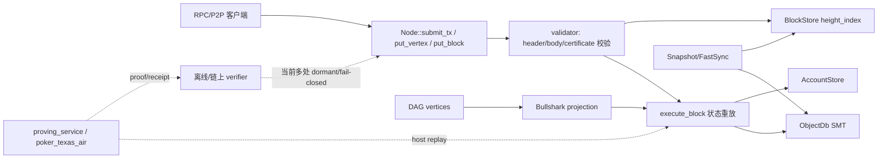

# zchain 全面安全与架构审计报告

**审计日期**：2026-08-01  
**审计对象**：`/Users/mac/projects/zchain` 工作树  
**审计类型**：源码静态安全审查、架构与信任边界梳理、构建/测试可复现性检查  
**审计结论**：当前版本不具备“可直接用于主网”的安全保证。存在可影响共识接受、状态一致性、资产记账和节点可用性的高风险缺陷；同时，链上 ZK 验证、递归聚合、轻客户端和完整牌局证明仍未闭环。

## 1. 执行摘要

本次审计没有修改业务代码，只新增本报告。主要结论如下：

1. `Node::validate_block` 对低于 quorum 的 commit certificate 进入弱校验分支，实际上既不检查 quorum，也不检查签名；配置为空 validator 集时还会跳过 validator 成员与证书校验。这使共识信任根可被配置错误或伪造区块绕过。
2. 区块生产和验证对 `public_txs` / `gameturn_txs` 的执行语义不一致：部分生产路径执行全部交易，`validate_block` 和 `project_block_from_commit` 只执行 public 通道。带状态变化的 GameTurn 交易会导致拒块或状态根承诺不一致。
3. 交易执行声称失败时“无状态变更”，但桥铸币、预编译/rBPF 对象写入、转账扣款和输出创建可能已经落库，随后步骤失败只返回失败回执，不回滚。
4. P2P 没有身份认证/加密；RPC 的 TCP 传输层读取无行长上限和读超时，默认守卫不要求写入/密码学接口认证，并且传输层永远传入 `api_key: None`。
5. Fast Sync 的追块步骤只查询本地区块并把状态标记为 `Synced`，没有下载、应用或验证区块；快照应用出错也没有 rollback。
6. `rebuy` 明确未校验真实资金来源，可在启用该接口时凭空增加筹码；`auto_fold` 未校验是否真的超时。
7. `cargo test --workspace --no-fail-fast` 当前失败，至少存在 `poker_l1` 两处 RPC 编译错误和 `stwo-cairo-prover` 缺失开发依赖错误。故“全量测试通过”不能作为当前版本结论。

风险评级采用：

- **P0**：可直接破坏共识安全、状态承诺或资产完整性；上线前必须阻断。
- **P1**：高概率造成活性、可用性或经济损失，或在常见部署条件下可利用。
- **P2**：潜在安全缺口、边界条件或启用未完成功能后会变成攻击面。

## 2. 审计范围与方法

### 2.1 覆盖范围

- `src/main.rs`：节点进程、RPC/P2P TCP、validator 产块循环。
- `poker_l1`：区块/交易、Bullshark/DAG 共识、节点验证、执行器、ObjectDb/AccountStore、同步、桥、VM/precompile、离线 verifier、RPC trait。
- `poker_zkvm`：RISC-V/Stwo 后端、CPU/Memory/AIR、递归验证器和哈希 AIR。
- `poker_texas_air`：21 个 Texas Poker method AIR、host verifier、state-root/receipt、aggregator PoC。
- `proving_service`：离线证明 HTTP 服务、插件状态和聚合入口。
- `poker_lean`：soundness、trust boundary 和状态模型的形式化范围声明。
- `docs/`：架构、信任模型、离线证明和电路契约对齐文档。

### 2.2 方法

1. 以数据流和信任边界为主线阅读模块及其调用关系。
2. 对共识验证、状态根重放、资产记账、网络入口、同步恢复和 proof verifier 做逐行检查。
3. 扫描 `TODO`、`unimplemented!`、`todo!`、`Stub`、`axiom`、`fail-closed` 等显式未完成标记。
4. 执行 workspace 与分 crate 构建/测试命令，记录可复现错误。

本报告是源码审查，不等同于已完成的模糊测试、网络渗透测试、密码学参数审计、依赖供应链审计或生产配置审计。

## 3. 系统架构与数据流

### 3.1 组件分层

| 层 | 组件 | 责任 | 当前信任假设 |
|---|---|---|---|
| 进程/传输 | `src/main.rs` | TCP RPC、P2P、validator 产块、广播 | 入站 peer/客户端当前没有强身份绑定 |
| L1 共识 | `poker_l1::consensus` | DAG vertex、Bullshark 排序、commit certificate、quorum | 正确性依赖 validator 集和证书校验完整执行 |
| L1 节点 | `poker_l1::node` | vertex/block 接收、状态重放、入库 | `genesis_validators` 必须正确配置 |
| 执行/状态 | `executor`、`ObjectDb`、`AccountStore` | tx 执行、对象 SMT、账户余额/nonce | 失败交易必须原子，否则状态会漂移 |
| VM/合约 | rBPF、precompile、Texas Poker dispatch | 游戏状态、桥、转账、密码学调用 | caller 授权、资金来源和 proof verifier 必须真实接线 |
| 同步/存储 | `sync`、`BlockStore`、快照 | 快照、追块、height index | 同步输入必须逐块验证并可回滚 |
| ZK 证明 | `poker_zkvm`、`poker_texas_air` | AIR、host replay、Stwo proof、递归 PoC | 生产入口目前多处 fail-closed；不能将 PoC 当成 ZK 保证 |
| 离线服务 | `proving_service` | `/hands/run` 片段、插件编排 | 本地状态和共识 anchor 尚未接入 |
| 形式化 | `poker_lean` | 手写 AIR/Contract 蕴含和公理审计 | 尚未证明 Rust 实现与 Lean 谓词等价 |

### 3.2 主要数据流

### 3.3 信任边界

1. **网络边界**：RPC 和 P2P listener 对外接收不可信字节流。认证、限流、超时和消息上限必须在解析前生效。
2. **共识边界**：block header、body、DAG certificate 是外部共识输入，必须由同一规则验证并重放。
3. **状态边界**：ObjectDb、AccountStore、BridgeRegistry 是持久化状态；单笔交易失败不能留下跨存储的部分提交。
4. **证明边界**：host replay、AIR、递归 verifier 和 Lean 模型是不同层次的保证，不能将任一层的测试通过等同于端到端 soundness。
5. **运维边界**：validator 私钥、genesis validator 列表、RPC 监听地址和桥/Treasury 配置决定安全基线；默认值不能带来“无信任根”状态。

## 4. 漏洞与缺陷清单

### P0-1：低 quorum certificate 被接受，且弱分支不验证签名

**证据**：[`poker_l1/src/node/mod.rs:897-928`](/Users/mac/projects/zchain/poker_l1/src/node/mod.rs:897)。当 active validator 集非空且签名数小于 `required_quorum` 时，代码仅遍历 `signature_list` 后丢弃 `signing_hash`/`sig`，随后记录 warning 并继续；严格的 `validate_commit_certificate_signatures` 只在 `signer_count >= required` 时调用。该严格函数本身在 [`poker_l1/src/block/validator.rs:444-491`](/Users/mac/projects/zchain/poker_l1/src/block/validator.rs:444) 才执行 quorum、bitmap 和逐签名验证。

**利用前提**：攻击者能把 block/证书送入节点；或诚实产块路径生成低于 quorum 的证书。

**影响**：无 2/3 证书的 block 可能被入库和继续传播，造成不同节点接受不同提交、伪造 commit 或共识分叉。DAG 引用不能替代证书验证，除非协议明确规定并实现了可独立验证的 DAG quorum 规则。

**建议**：任何生产 block 都必须无条件执行 quorum、bitmap、validator membership、签名和证书字段绑定；若确有引导期，必须是显式 genesis-only 状态机，并限制高度/epoch/网络身份，不能用“低于 quorum 但继续”作为常规分支。

### P0-2：`public_txs` 与 `gameturn_txs` 的状态重放不一致

**证据**：

- `Node::validate_block` 在 [`poker_l1/src/node/mod.rs:947-950`](/Users/mac/projects/zchain/poker_l1/src/node/mod.rs:947) 只调用 `execute_block(&env, &block.public_txs, ...)`。
- Bullshark 投影在 [`poker_l1/src/consensus/bullshark.rs:294-311`](/Users/mac/projects/zchain/poker_l1/src/consensus/bullshark.rs:294) 拆分两个通道后同样只执行 `public_txs`。
- `src/main.rs` 的 `build_block_from_vertex` 在 [`src/main.rs:1588-1603`](/Users/mac/projects/zchain/src/main.rs:1588) 却对 `sorted_txs`（含两个通道）执行；commit path 也对全部排序交易执行 [`src/main.rs:1457-1487`](/Users/mac/projects/zchain/src/main.rs:1457)。

**利用前提**：block 包含会改变对象状态的 GameTurn 或 CheckpointAnchor 交易。

**影响**：不同产块/验证路径计算不同的 state root；合法 block 可能被拒绝，或某路径产生的 state root 没有承诺 GameTurn 状态变化，导致链状态分叉或游戏状态丢失。

**建议**：定义唯一的 canonical execution order；header 的 state root、certificate 的 state root 和验证重放必须对同一有序交易序列执行。分别存储 merkle root 不代表可以分别省略状态执行。

### P0-3：空 genesis validator 集跳过成员和证书校验

**证据**：[`poker_l1/src/node/mod.rs:813-827`](/Users/mac/projects/zchain/poker_l1/src/node/mod.rs:813) 在 validator 集为空时跳过 vertex author membership；[`poker_l1/src/node/mod.rs:902-929`](/Users/mac/projects/zchain/poker_l1/src/node/mod.rs:902) 在 active key 为空时完全跳过 certificate 验证。`NodeConfig::default_full`、`validator`、`archive`、`light` 均默认 `genesis_validators: vec![]`，见 [`poker_l1/src/node/mod.rs:134-187`](/Users/mac/projects/zchain/poker_l1/src/node/mod.rs:134)。

**利用前提**：生产启动没有加载 genesis validator 文件，或攻击者能诱导使用默认配置。

**影响**：任意可生成有效单签名的 key 都可能被当作共识 author；commit certificate 不再有信任根。即便签名算法本身正确，validator membership 已失去约束。

**建议**：生产模式拒绝空 validator 集；引导期使用一次性、受高度/链 ID/固定 genesis hash 约束的配置，并在启动时打印并强制校验 validator set hash。测试/内存节点应与生产构造函数分离。

### P0-4：失败交易不是全有或全无，可能留下部分状态

**证据**：`execute_tx` 将内部错误统一转成失败回执，并声称不产生状态变更 [`poker_l1/src/executor/mod.rs:192-241`](/Users/mac/projects/zchain/poker_l1/src/executor/mod.rs:192)。但执行顺序中：

- bridge 在 [`poker_l1/src/executor/mod.rs:343-375`](/Users/mac/projects/zchain/poker_l1/src/executor/mod.rs:343) 先 mint object、持久化 deposit nonce；
- precompile/rBPF 在 [`poker_l1/src/executor/mod.rs:398-435`](/Users/mac/projects/zchain/poker_l1/src/executor/mod.rs:398) 直接写入 object backend；
- `transfer` 在 [`poker_l1/src/executor/mod.rs:377-397`](/Users/mac/projects/zchain/poker_l1/src/executor/mod.rs:377) 先 debit caller；
- 然后才执行 `apply_tx_outputs` 和账户结算 [`poker_l1/src/executor/mod.rs:441-456`](/Users/mac/projects/zchain/poker_l1/src/executor/mod.rs:441)。

`apply_tx_outputs` 的预检不能撤销前面已经完成的写入；并行执行器的 write log merge 也无法在后续交易失败后撤回已合并 mutation。

**利用前提**：构造一个前置写入成功、后置输出/结算失败的交易，或触发跨对象/跨存储错误。

**影响**：失败回执与实际 ObjectDb、AccountStore、BridgeRegistry 状态不一致；可能造成凭空铸造、nonce 消耗、余额扣除或 state root 漂移。

**建议**：每笔交易使用真正的事务层：对象写集、账户 delta、bridge nonce 和事件全部先在临时视图中校验，最后以单个原子 batch 提交；任何提交失败都回滚。为 bridge、transfer、precompile、outputs 增加“失败后所有存储快照等价”的回归测试。

### P1-1：高度为 0 时 `header.height - 1` 可能 panic

**证据**：[`poker_l1/src/node/mod.rs:875-884`](/Users/mac/projects/zchain/poker_l1/src/node/mod.rs:875) 在检查 genesis 前直接计算 `header.height - 1`。

**利用前提**：发送 height 为 0 的 block，或节点以 debug 构建运行。

**影响**：整数下溢导致 panic；P2P 处理线程退出，重复请求可造成资源消耗；Genesis block 也无法走清晰的专用校验路径。

**建议**：显式分支 `height == 0`，校验 genesis 约束；非 genesis 高度使用 `checked_sub(1)`，缺前块时拒绝而不是静默继续。

### P1-2：P2P 入站连接无身份认证、加密和 validator 绑定

**证据**：listener 接收连接后直接起线程处理 [`src/main.rs:604-614`](/Users/mac/projects/zchain/src/main.rs:604)；peer 注册只记录地址，`validator_pubkey: None` [`src/main.rs:1091-1099`](/Users/mac/projects/zchain/src/main.rs:1091)；消息接收仅做长度和 Borsh 解析 [`src/main.rs:1054-1073`](/Users/mac/projects/zchain/src/main.rs:1054)。

**利用前提**：攻击者能访问 P2P 监听端口。

**影响**：任意主机可占用连接/线程、发送 range 请求、触发验签/存储/状态重放成本，或伪装为 peer 参与传播。交易/vertex 的单条签名校验不能替代 peer 身份和传输层抗滥用。

**建议**：使用 Noise/TLS 或等价的双向认证握手；将 peer identity 与 validator pubkey/许可列表绑定；为入站连接设置握手超时、并发配额、每 peer 配额和异常封禁。

### P1-3：RPC 读取无行长上限、无读超时

**证据**：[`src/main.rs:784-804`](/Users/mac/projects/zchain/src/main.rs:784) 使用 `BufReader::lines()` 读取完整行后才解析；`MAX_RPC_PARAMS_SIZE` 只在 handler 对已构造的 params 序列化后检查 [`poker_l1/src/rpc/mod.rs:659-677`](/Users/mac/projects/zchain/poker_l1/src/rpc/mod.rs:659)。

**利用前提**：访问 RPC TCP 端口，发送超长且不换行的数据，或保持慢速连接。

**影响**：单连接内存增长、线程长期占用和连接槽耗尽，形成 DoS。解析后的 params 限制不能保护解析前的 line buffer。

**建议**：使用 `read_until`/自定义 framing，在读取阶段强制最大行长；设置 read/write timeout、空闲连接回收和总连接/每 IP 配额。

### P1-4：RPC 默认不要求认证，且 TCP 层永远没有 API key

**证据**：`AuthConfig` 默认 `require_auth_for_write=false`、`require_auth_for_crypto=false` [`poker_l1/src/rpc/mod.rs:361-370`](/Users/mac/projects/zchain/poker_l1/src/rpc/mod.rs:361)，`RpcGuard::default_config()` 使用该默认值 [`poker_l1/src/rpc/mod.rs:430-438`](/Users/mac/projects/zchain/poker_l1/src/rpc/mod.rs:430)；节点启动使用默认守卫 [`src/main.rs:560-562`](/Users/mac/projects/zchain/src/main.rs:560)；传输层构造 `RpcClientInfo` 时固定 `api_key: None` [`src/main.rs:774-778`](/Users/mac/projects/zchain/src/main.rs:774)。

**利用前提**：RPC 绑定到非 loopback 地址，或通过端口转发/代理对外暴露。

**影响**：写交易和密码学验证接口仅受速率限制保护；配置了 allowed API keys 也无法通过当前 TCP 协议传入 key。未授权客户端可消耗状态写入和高成本 crypto 资源。

**建议**：生产默认拒绝未认证写/crypto 请求；设计明确的 TLS/HTTP header 或首帧认证协议；启动时若监听非 loopback 且未配置认证应直接失败。

### P1-5：P2P range 请求可触发大范围扫描和响应构造

**证据**：[`src/main.rs:1180-1187`](/Users/mac/projects/zchain/src/main.rs:1180) 直接执行请求范围；`collect_blocks_by_range` 遍历 `start..=end`，只在找到 512 个 block 后停止 [`src/main.rs:1223-1244`](/Users/mac/projects/zchain/src/main.rs:1223)。

**利用前提**：已连接任意 P2P peer，提交极大且大部分不存在的高度范围。

**影响**：长时间 RocksDB 查询、连接线程占用和日志放大；找到 512 个 block 后还会先构造大对象，再由 16 MiB 消息限制拒绝，造成峰值内存压力。

**建议**：请求进入时限制 `end - start`、按固定页大小返回、设置每 peer 预算和超时，并在序列化前估算响应大小。

### P1-6：Fast Sync 追块没有下载、应用或验证区块

**证据**：[`poker_l1/src/sync/mod.rs:476-500`](/Users/mac/projects/zchain/poker_l1/src/sync/mod.rs:476) 从本地 `BlockStore` 查询范围，计算 `blocks.len()` 后直接将状态改为 `Synced`；没有 peer fetch、`put_block`、prev hash、certificate 或 state root 验证。

**利用前提**：节点从快照高度启动，目标 tip 高于快照高度，或本地 block store 不完整/不可信。

**影响**：节点可能在缺块或未验证状态的情况下宣称同步完成，RPC/P2P 会基于不完整链状态工作。

**建议**：追块必须从认证 peer 拉取每个 block，按高度连续性、链 ID、证书、交易 roots、状态根逐块调用统一验证入口；全部成功后才标记 `Synced`。

### P1-7：快照应用错误时没有 rollback，且实现与“清空目标库”注释不一致

**证据**：注释声称“清空目标库”但 [`poker_l1/src/sync/mod.rs:282-285`](/Users/mac/projects/zchain/poker_l1/src/sync/mod.rs:282) 没有清空；`apply_chunks` 逐对象直接 `create`，中途失败或最终 root 不匹配时已写入对象不会撤销 [`poker_l1/src/sync/mod.rs:298-325`](/Users/mac/projects/zchain/poker_l1/src/sync/mod.rs:298)。

**影响**：重试会遇到碰撞；部分快照状态可能被后续逻辑误用，恢复过程不具备原子性。

**建议**：写入临时 ObjectDb/新 RocksDB column family，完成 object count、chunk coverage 和 state root 校验后原子切换；失败直接丢弃临时库。

### P1-8：同一 height 的不同 block 可覆盖 height index

**证据**：`BlockStore::put` 只以 block hash 幂等，随后无条件写 `height_index`；文档明确把“同 height 不被不同 block 覆盖”的责任交给调用方 [`poker_l1/src/storage/block_store.rs:81-100`](/Users/mac/projects/zchain/poker_l1/src/storage/block_store.rs:81)。`Node::validate_block` 没有拒绝已存在 height 的不同 hash。

**影响**：只要不同 block 通过当前不完整验证，后写 block 会改写本地 height → hash 映射；查询 tip、追块和状态重放可能读取非共识分支。

**建议**：存储层做 compare-and-set：height 已有 hash 且不同即拒绝；分叉必须进入显式 fork/rollback 流程，不能覆盖 canonical index。

### P1-9：`rebuy`/`addon` 没有真实资金来源校验

**证据**：`dispatch_addon` 只检查 caller 是座位玩家并修改记账 [`poker_l1/src/vm/contracts/texas_poker/dispatch.rs:1382-1400`](/Users/mac/projects/zchain/poker_l1/src/vm/contracts/texas_poker/dispatch.rs:1382)；`dispatch_rebuy` 同样只检查座位玩家并增加 stack [`poker_l1/src/vm/contracts/texas_poker/dispatch.rs:1402-1418`](/Users/mac/projects/zchain/poker_l1/src/vm/contracts/texas_poker/dispatch.rs:1402)。源码注释明确称这是“凭空增发风险”。

**利用前提**：主网启用这些 dispatch，且没有上层 Treasury/PaymentProof gate。

**影响**：玩家可无限增加筹码，破坏牌局经济和资产守恒；`addon` 在下一手合并后同样形成无担保余额。

**建议**：在同一原子交易中验证账户扣款/Treasury lock/deposit proof 与牌桌入账；Treasury 接入前在生产构建中硬禁用 rebuy/addon，而不是依赖运维约定。

### P1-10：`auto_fold` 不验证真实超时

**证据**：[`poker_l1/src/vm/contracts/texas_poker/dispatch.rs:1188-1201`](/Users/mac/projects/zchain/poker_l1/src/vm/contracts/texas_poker/dispatch.rs:1188) 仅要求 creator caller，源码 TODO 明确“当前不校验是否真已超时”，随后直接 `apply_fold_internal`。

**影响**：creator 可在任何时刻把任意座位标记为超时 fold，破坏牌局公平性并可能改变底池归属。

**建议**：以 block height/共识时间为权威，验证当前 turn、turn_started、timeout config 和未过期状态；权限与超时条件必须在 AIR/VM replay 和事件中一致。

### P2-1：SHA-256 AIR 的核心约束尚未实现（启用后可造假 proof）

**证据**：[`poker_zkvm/src/stwo_backend/sha256_air.rs:21-41`](/Users/mac/projects/zchain/poker_zkvm/src/stwo_backend/sha256_air.rs:21) 自述 compression/message schedule/boundary 约束未实现，当前 `evaluate` 可让任意 trace 通过；[`poker_zkvm/src/stwo_backend/sha256_air.rs:373-434`](/Users/mac/projects/zchain/poker_zkvm/src/stwo_backend/sha256_air.rs:373) 仍为 TODO。

**当前状态**：文件同时声明该 AIR 尚未接入 proof path，并由构造 guard 禁止启用。因此这是“潜在漏洞/上线门禁”，不是当前已接线的直接攻击面。

**建议**：完成 compression、schedule、round boundary、multi-block 和 logup 约束，并加入恶意 trace 负例；在完成前保持构造入口不可达。

### P2-2：Memory AIR 首次 Load 的公共输入绑定缺失

**证据**：[`poker_zkvm/src/stwo_backend/memory_air.rs:263-293`](/Users/mac/projects/zchain/poker_zkvm/src/stwo_backend/memory_air.rs:263) 明确首次访问 Load 不约束 `ValCur=ValPrev`，其正确值应由 public input binding 提供，但该 binding 仍是“待实现”。

**影响**：若未来递归/VM proof path 直接依赖该 AIR，prover 可能伪造首次 Load 值并同步伪造 CPU claim；当前递归 verifier 因未闭合而禁用，风险暂被 fail-closed 掩盖。

**建议**：把 ECALL 写入和 public input 绑定纳入 memory trace，证明首次 Load 的值来自已承诺输入；增加跨组件 logup 和篡改负例。

## 5. 未完成、未接入或不应宣称已完成的功能

### 5.1 ZK 与形式化

- **链上 `zk_verify` dormant**：`NodeBackend::zk_verifier_registry()` 返回 `None`，见 [`poker_l1/src/node/mod.rs:1377-1379`](/Users/mac/projects/zchain/poker_l1/src/node/mod.rs:1377)。架构文档说明真实证明走 proving service 的 host-side path，不是链上 verifier。
- **Aggregator 只是 descriptor-only PoC**：生产验证入口始终返回 `UntrustedAggregationDisabled`，见 [`poker_texas_air/src/aggregator_verifier.rs:25-39`](/Users/mac/projects/zchain/poker_texas_air/src/aggregator_verifier.rs:25)；测试入口只验证摘要 AIR，不验证子 proof [`poker_texas_air/src/aggregator_verifier.rs:41-54`](/Users/mac/projects/zchain/poker_texas_air/src/aggregator_verifier.rs:41)。
- **21 个 Texas Poker AIR 不是端到端业务证明**：[`poker_lean/PokerLean/Audit/SoundnessAudit.lean:6-23`](/Users/mac/projects/zchain/poker_lean/PokerLean/Audit/SoundnessAudit.lean:6) 明确限定为手写 Lean `AirAcceptable -> Contract`；尚未证明 Rust `FrameworkEval`、trace/public input/state root、VM dispatch、结算、aggregator 和 DLEq/shuffle/reveal/reconstruct 子证明等价。
- **Lean 存在自定义 axiom 信任根**：`PoseidonHash.lean` 和 `Contract/Types.lean` 分别声明 `poseidon_hash`、`texasPokerTableToPreimage` axiom。不能将 `#print axioms` 的模型结果表述为真实 Rust 实现已被形式化证明。
- **selector 21/22**：`request_leave_after_hand`、`fold_with_proof` 保留 wire compatibility，但生产 proof/receipt 显式 fail-closed，Lean 也没有对应 theorem。

### 5.2 证明服务与游戏业务

- **`proving_service /dispatch` 返回 501**：[`proving_service/src/server.rs:114-121`](/Users/mac/projects/zchain/proving_service/src/server.rs:114) 明确等待持久化 plugin state 和 prove/verify 接线；`/hands/run` 只是覆盖片段，不代表完整牌局或共识锚定。
- **完整 end-of-round/settlement 未闭环**：`poker_texas_air` 的 call/raise/bet 生产证明被限制到 same-round、pot unchanged 的 mid-round 分支；收池、round advance、side pot、结算和 physical row/refinement 仍缺。
- **密码学子证明 AIR 未嵌入**：例如 reveal token AIR 的 [`poker_texas_air/src/airs/crypto/submit_player_reveal_tokens.rs:143`](/Users/mac/projects/zchain/poker_texas_air/src/airs/crypto/submit_player_reveal_tokens.rs:143) 仍标注等待 verifier AIR；shuffle/reconstruct 同类。
- **Texas Poker AIR 输入约束存在 PoC 简化**：`create_table` 的 max players lookup、big blind 非零 witness、name hash/Poseidon 和 4 limb→8 limb 表示仍是 TODO/占位，见 [`poker_texas_air/src/airs/lifecycle/create_table.rs:180-207`](/Users/mac/projects/zchain/poker_texas_air/src/airs/lifecycle/create_table.rs:180) 与 [`poker_texas_air/src/airs/lifecycle/create_table.rs:283-357`](/Users/mac/projects/zchain/poker_texas_air/src/airs/lifecycle/create_table.rs:283)。

### 5.3 网络、轻节点与同步

- **Light node header subscription 未实现**：[`src/main.rs:1010-1013`](/Users/mac/projects/zchain/src/main.rs:1010) 直接返回空 vector。
- **`RequestVerticesByRange` 未实现**：请求缺 epoch 上下文，当前始终返回空列表 [`src/main.rs:1189-1200`](/Users/mac/projects/zchain/src/main.rs:1189)。
- **`CompactVertex` 重建未实现**：接收后直接丢弃/记录 debug [`src/main.rs:1201-1205`](/Users/mac/projects/zchain/src/main.rs:1201)。
- **裁剪与完整轻客户端协议仍是路线图缺口**：架构文档指出 `PruningConfig` 尚无裁剪逻辑，`LightClientVerifyRequest` 尚无完整协议，compact vertex 的短 ID/缺失 tx 回退也未实现。

## 6. 构建、测试与代码健康状态

### 6.1 可复现命令

| 命令 | 结果 |
|---|---|
| `cargo test --workspace --no-fail-fast` | **失败**：`poker_l1/src/rpc/mod.rs:919` 找不到 `RpcBackend::node()`；`:922` 不存在 `RpcHandlerError::Server`；`third_party/stwo-cairo/prover/src/prover.rs:360-361` 找不到 `stwo_cairo_dev_utils`。 |
| `cargo test -p vm-common --lib` | 通过，53 passed。 |
| `cargo check -p poker_zkvm --lib` | 通过，但有大量 unused/dead-code/未接线告警。 |
| `cargo check -p poker_l1 --lib` | 失败，RPC 两个编译错误。 |
| `cargo test -p poker_l1 --lib` | 失败，先被同一 RPC 编译错误阻断。 |
| `cargo test -p poker_texas_air --lib` | 依赖 `poker_l1`，被同一 RPC 编译错误阻断。 |

### 6.2 质量信号

- workspace 输出大量 unused import、dead code、deprecated `StubVerifier` 警告；这本身不等于漏洞，但说明已实现、PoC、测试专用路径边界不够清晰。
- `poker_l1` 顶层 `deny(unsafe_code)` 仅在 VM/syscall 交互模块放宽；这些裸指针边界需要独立不变量审计，不能以全 crate 的 lint 结果替代。
- 报告未执行外部网络攻击、资源压测、RocksDB 故障注入、并发竞态测试和密码学参数/随机数审计。

## 7. 修复优先级路线

### 阶段 A：上线阻断（P0，先于任何主网部署）

1. 删除弱 certificate 分支，强制 validator membership、quorum、bitmap、签名和证书字段绑定。
2. 固化唯一 block execution order；统一 producer、Bullshark projection、validator replay 对两条交易通道的执行。
3. 禁止生产空 genesis validator 集，加入 genesis set hash 和启动自检。
4. 实现跨 ObjectDb/AccountStore/BridgeRegistry 的交易事务提交和 rollback；用失败后状态快照测试证明原子性。
5. 在 P0 修复完成后重新生成并验证 state root、certificate 和 block storage 回归向量。

### 阶段 B：网络与恢复面硬化（P1）

1. 加入 P2P 双向认证、peer/validator 绑定、握手/空闲/读取超时和每 peer 配额。
2. RPC 使用有界 framing，默认强制写/crypto 认证；非 loopback 监听未配置认证时拒绝启动。
3. 限制 range 请求跨度、响应页大小和资源预算。
4. Fast Sync 改为认证 peer 下载、逐块验证、原子应用；快照写临时库后再切换。
5. BlockStore height index 使用 compare-and-set，拒绝同 height 不同 hash 覆盖。
6. 接入 Treasury/PaymentProof 前禁用 `rebuy`/`addon`，补齐 `auto_fold` 超时判定和 block-height 语义。

### 阶段 C：证明与功能闭环（P2/产品完整性）

1. 完成 SHA-256/Memory AIR 缺失约束，并建立恶意 trace 负例。
2. 完成 Texas Poker end-of-round、side-pot、settlement、密码学子证明和 Rust↔Lean refinement。
3. 实现可信 recursive verifier/aggregator；在此之前所有生产入口保持 fail-closed，文档不得使用“递归证明已完成”。
4. 接通链上 `zk_verify`，定义 verifier registry 的生产初始化和治理升级流程。
5. 完成 `/dispatch` 持久化状态、完整牌局和共识 anchor；实现 light header、vertex range 和 compact vertex 协议。

## 8. 发布门槛与不应宣称的安全属性

在上述阶段 A/B 未完成前，不应宣称：

- “commit certificate 已经严格保证 2/3 quorum”；
- “所有失败交易都是原子回滚”；
- “Fast Sync 完成后节点状态已验证”；
- “RPC/P2P 已认证且可安全暴露公网”；
- “21/21 Texas Poker AIR 已证明真实 Rust 实现 sound”；
- “递归聚合/单证明已完成”；
- “链上 `zk_verify` 已验证离线证明”；
- “workspace 全量测试通过”或“具备生产部署条件”。

## 9. 总体结论

代码库已经形成较清晰的 L1、VM、ZK、离线服务和形式化模型分层，也包含若干 fail-closed 设计。但当前实现存在四个必须优先处理的基础问题：共识证书接受条件、双交易通道状态语义、交易/同步原子性、网络入口认证与资源界限。与此同时，资产经济的 `rebuy`/`addon` 资金来源、超时动作和完整牌局结算仍未闭环。

因此，当前版本适合作为持续开发和安全修复基线，不适合作为未经额外门禁的主网节点或高价值牌局结算实现。

