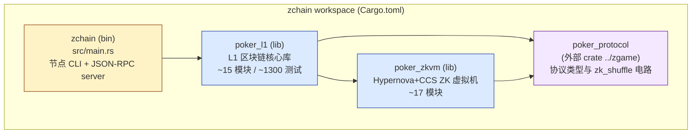
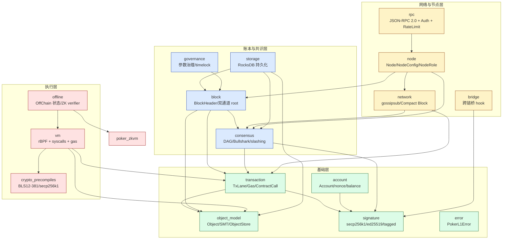
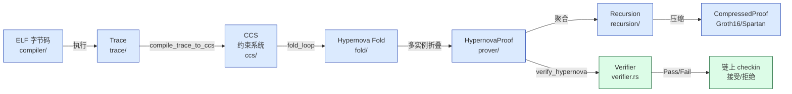
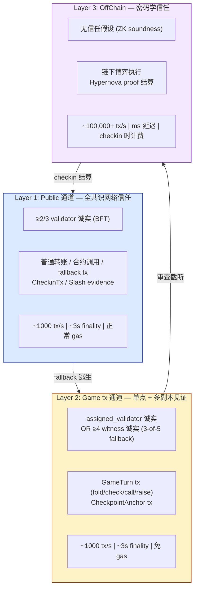
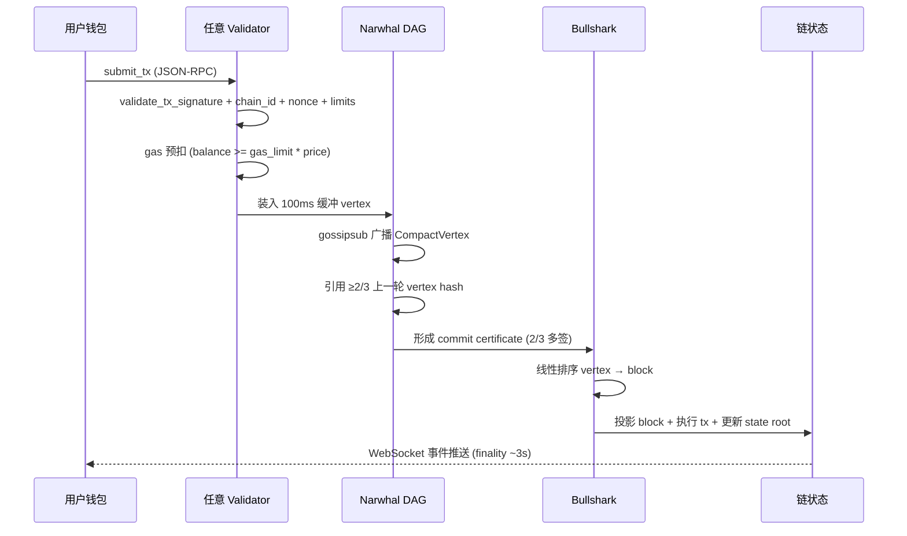
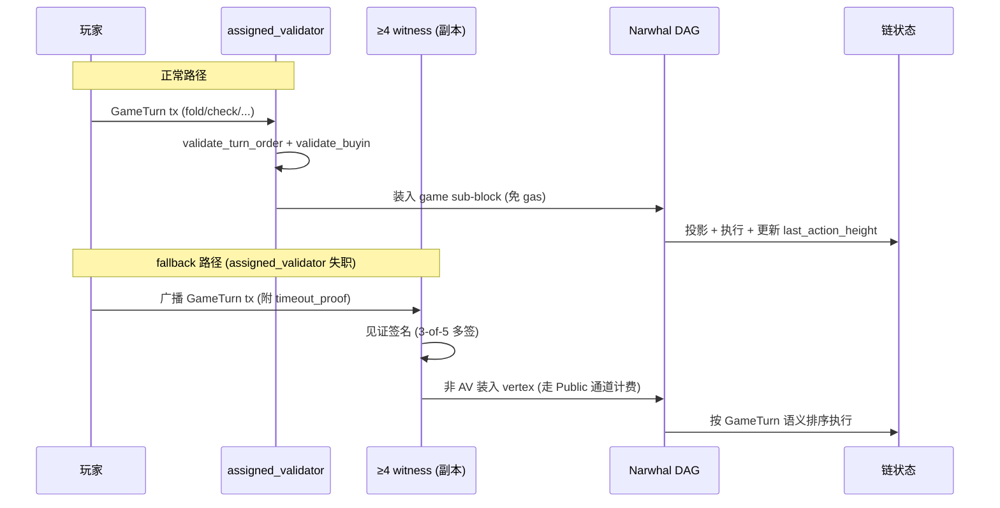
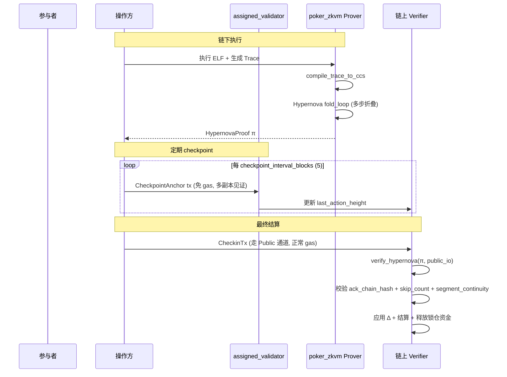

# zchain 项目架构总览

> 本文档系统梳理 zchain 仓库的整体架构、模块职责、信任模型与执行流水线，并与市场主流区块链进行横向对比，作为新成员入门、架构评审与对外宣讲的统一入口。
>
> 严格对齐源码实现：
> - 仓库根 `Cargo.toml`（workspace 定义）、`src/main.rs`（节点二进制入口）
> - `poker_l1/src/lib.rs`（L1 链核心库模块声明）
> - `poker_zkvm/src/lib.rs`（ZK 虚拟机模块声明）
> - `docs/37-1 ~ 37-10`（已有运维 / 信任模型文档）

---

## 1. 项目定位

zchain 是面向**链下博弈与高吞吐游戏场景**的 L1 区块链，核心设计目标：

| 目标 | 实现方式 |
| --- | --- |
| **游戏操作免 gas** | GameTurn 通道（spec 硬约束），由买入锁仓反滥用 |
| **链下执行 + 链上结算** | OffChain 模式 + Hypernova ZK 证明 |
| **渐进式信任最小化** | 三层信任模型：BFT 共识 → 单点+见证 → 密码学 |
| **高吞吐低延迟** | Narwhal-Bullshark DAG + Compact Block Relay + 无 mempool |
| **多曲线钱包支持** | secp256k1 / ed25519 tagged pubkey 统一接口 |
| **可治理可升级** | 链上参数治理 + rBPF 合约 UpgradeCap |

---

## 2. Workspace 顶层架构

zchain 是一个 Cargo workspace，包含 2 个核心 crate + 1 个二进制入口：



| crate | 角色 | 关键依赖 |
| --- | --- | --- |
| `zchain` | 节点二进制入口（`node` / `keygen` 子命令） | `poker_l1`, `tokio`, `tracing-subscriber` |
| `poker_l1` | L1 链核心库：交易 / 区块 / 共识 / VM / RPC / 节点 | `poker_zkvm`, `poker_protocol`, `solana_rbpf`, `blstrs`, `secp256k1`, `ed25519-dalek`, `rocksdb` |
| `poker_zkvm` | ZK 证明系统：CCS / Hypernova / CycleFold / Groth16 / IPA | `ark-*` (arkworks 0.6), `goblin`, `rayon` |
| `poker_protocol` | 协议类型库（外部仓库） | `blstrs`, `sha2` |

二进制入口 `src/main.rs` 提供 4 类节点角色（`validator` / `full` / `archive` / `light`），通过 newline-delimited JSON-RPC over TCP 暴露接口，支持 SIGINT/SIGTERM 优雅关闭与 `--max-connections` 限流。

---

## 3. poker_l1 模块架构

### 3.1 模块依赖图



### 3.2 模块清单

| 模块 | 职责 | 关键类型 |
| --- | --- | --- |
| [`object_model`](file:///Users/mac/projects/zchain/poker_l1/src/object_model/mod.rs) | 对象模型（Object / ObjectID / Ownership）+ Sparse Merkle Tree + ObjectStore | `Object`, `ObjectID`, `ObjectStore`, `SparseMerkleTree` |
| [`signature`](file:///Users/mac/projects/zchain/poker_l1/src/signature/mod.rs) | 多曲线钱包签名（tagged pubkey + secp256k1 + ed25519 + low-s 强制） | `TaggedPubkey`, `SignatureScheme`, `verify_signature` |
| [`account`](file:///Users/mac/projects/zchain/poker_l1/src/account/mod.rs) | 账户抽象 + nonce / balance + 双通道重放保护 | `Account`, `validate_tx_nonce` |
| [`transaction`](file:///Users/mac/projects/zchain/poker_l1/src/transaction/mod.rs) | 交易结构 + 4 通道分类（Public/GameTurn/CheckpointAnchor/ForceSync） | `Transaction`, `TxLane`, `RouteHint`, `Gas`, `ContractCall` |
| [`block`](file:///Users/mac/projects/zchain/poker_l1/src/block/mod.rs) | 区块结构 + 双通道 tx_root + 时间共识 | `Block`, `BlockHeader`, `TimeConsensusConfig` |
| [`consensus`](file:///Users/mac/projects/zchain/poker_l1/src/consensus/mod.rs) | Narwhal-Bullshark DAG + game sub-block + slashing + validator set + VRF | `DagVertex`, `DagCommitCertificate`, `ValidatorEntry`, `SlashingReason` |
| [`storage`](file:///Users/mac/projects/zchain/poker_l1/src/storage/mod.rs) | RocksDB 持久化 + 裁剪策略 + 历史数据请求 | `BlockStore`, `ObjectDb`, `DagVertexStore`, `PruningConfig` |
| [`vm`](file:///Users/mac/projects/zchain/poker_l1/src/vm/mod.rs) | rBPF VM + syscalls + gas 计费 + 合约升级 | `PokerL1Context`, `execute_contract`, `UpgradeCap` |
| [`crypto_precompiles`](file:///Users/mac/projects/zchain/poker_l1/src/crypto_precompiles/mod.rs) | BLS12-381 G1/G2/pairing + 子群检查 + RFC 9380 hash-to-curve | `bls_verify`, `bls_hash_to_g1/g2` |
| [`offline`](file:///Users/mac/projects/zchain/poker_l1/src/offline/mod.rs) | OffChain 执行模式 + ZK verifier 热插拔 + checkpoint_anchor + checkin | `OfflineState`, `CheckinTx`, `CheckoutTx`, `ZkVerifierRegistry` |
| [`network`](file:///Users/mac/projects/zchain/poker_l1/src/network/mod.rs) | gossipsub + Compact Block Relay + 多副本广播 + tx_cache FIFO | `GossipManager`, `CompactVertex`, `TxBuf` |
| [`node`](file:///Users/mac/projects/zchain/poker_l1/src/node/mod.rs) | 节点入口 + 角色配置 + assigned_validator 本地路由 | `Node`, `NodeConfig`, `NodeRole`, `ValidatorKey` |
| [`rpc`](file:///Users/mac/projects/zchain/poker_l1/src/rpc/mod.rs) | JSON-RPC 2.0 + AuthConfig + RpcGuard 滑动窗口限流 | `RpcHandler`, `RpcGuard`, `JsonRpcResponse` |
| [`bridge`](file:///Users/mac/projects/zchain/poker_l1/src/bridge/mod.rs) | 跨链桥 hook + bridge_verify + BTreeSet 去重 + nonce 防重放 | `BridgeHook`, `bridge_verify` |
| [`governance`](file:///Users/mac/projects/zchain/poker_l1/src/governance/mod.rs) | 参数治理 + timelock + 边界校验 + 敏感参数 90% quorum | `GovernanceParams`, `ProposeParameterTx` |
| [`error`](file:///Users/mac/projects/zchain/poker_l1/src/error.rs) | 统一错误类型 `PokerL1Error` | `PokerL1Error`, `PokerL1Result` |

---

## 4. poker_zkvm 流水线架构

poker_zkvm 实现 **Hypernova + CCS + CycleFold** 折叠式 ZK 证明系统，是 OffChain 模式的密码学信任基础。

### 4.1 证明生成流水线



### 4.2 模块清单

| 模块 | 职责 |
| --- | --- |
| [`compiler`](file:///Users/mac/projects/zchain/poker_zkvm/src/compiler/mod.rs) | ELF 解析与加载（基于 goblin） |
| [`isa`](file:///Users/mac/projects/zchain/poker_zkvm/src/isa/mod.rs) | 指令集定义与 gas 表 |
| [`syscalls`](file:///Users/mac/projects/zchain/poker_zkvm/src/syscalls/mod.rs) | ZKVM 内部 syscalls（host 函数） |
| [`trace`](file:///Users/mac/projects/zchain/poker_zkvm/src/trace/mod.rs) | 执行 trace 数据模型（内存读写 / 步骤日志） |
| [`ccs`](file:///Users/mac/projects/zchain/poker_zkvm/src/ccs/mod.rs) | CCS（Customizable Constraint System）稀疏矩阵表示 |
| [`constraints`](file:///Users/mac/projects/zchain/poker_zkvm/src/constraints/mod.rs) | Trace → CCS 编译 + batch 连续性校验 |
| [`fold`](file:///Users/mac/projects/zchain/poker_zkvm/src/fold/fold_loop.rs) | Hypernova 折叠循环（CCCS ↔ LCCCS） |
| [`hypernova`](file:///Users/mac/projects/zchain/poker_zkvm/src/hypernova/mod.rs) | Hypernova 协议核心（sumcheck / PCS opening） |
| [`pcs`](file:///Users/mac/projects/zchain/poker_zkvm/src/pcs/mod.rs) | 多项式承诺方案（IPA / Hyrax-commitment） |
| [`lookup`](file:///Users/mac/projects/zchain/poker_zkvm/src/lookup/mod.rs) | Lookup argument（plookup / cached lookup） |
| [`cyclic`](file:///Users/mac/projects/zchain/poker_zkvm/src/cyclic/mod.rs) | CycleFold（递归折叠的 cycle 处理） |
| [`cyclegfold`](file:///Users/mac/projects/zchain/poker_zkvm/src/cyclegfold.rs) | CycleFold 节点（`CycleFoldNode` enum，大字段 `Box` 化） |
| [`recursion`](file:///Users/mac/projects/zchain/poker_zkvm/src/recursion/mod.rs) | 多 proof 聚合 + 树形递归 |
| [`prover`](file:///Users/mac/projects/zchain/poker_zkvm/src/prover/mod.rs) | 端到端 `prove()` 入口 + 测试辅助 |
| [`verifier`](file:///Users/mac/projects/zchain/poker_zkvm/src/verifier.rs) | 链上 verifier 接口（`verify_hypernova`） |
| [`transcript`](file:///Users/mac/projects/zchain/poker_zkvm/src/transcript.rs) | Fiat-Shamir transcript（domain `b"poker_zkvm_prover_v1"`） |
| [`precompiles`](file:///Users/mac/projects/zchain/poker_zkvm/src/precompiles/mod.rs) | ZK 电路预编译（zk_shuffle 等） |

### 4.3 关键设计

- **CCS（Customizable Constraint System）**：比 R1CS 更通用的约束系统，支持稀疏矩阵 + 任意子集乘积求和，是 Hypernova 的输入格式
- **Hypernova 折叠**：将多个 CCS 实例折叠为一个，prover 时间从 `O(N²)` 降到 `O(N log N)`，proof 大小保持 `O(log N)`
- **CycleFold**：处理折叠过程中产生的 cycle 依赖（non-uniform 计算），通过递归证明消除
- **多 proof 压缩**：最终可通过 Groth16 或 Spartan 进一步压缩 proof 大小
- **生产 verifier 热插拔**：通过 `VerifierStatus` 治理切换 Stub ↔ Production，主网 chain_id 下 Stub 状态拒绝 OffChain checkout

---

## 5. 三层信任模型

zchain 的核心创新是**渐进式信任最小化**，按 tx 通道与执行模式分为三层（详见 [37-10-trust-layer-model.md](file:///Users/mac/projects/zchain/docs/37-10-trust-layer-model.md)）：



| 层 | 信任假设 | 安全性 | 性能 | gas 计费 | 典型场景 |
| --- | --- | --- | --- | --- | --- |
| **Layer 1** | ≥2/3 validator 诚实 | 最高（全网共识） | ~1000 tx/s, ~3s | 正常计费 | 转账 / 合约 / fallback / CheckinTx / slashing |
| **Layer 2** | assigned_validator 诚实 OR ≥4 witness 诚实 | 中（单点+fallback） | ~1000 tx/s, ~3s | **免 gas** | 游戏内实时交互 / CheckpointAnchor |
| **Layer 3** | 无（仅 ZK soundness） | 密码学保证 | ~100,000+ tx/s, ms 延迟 | checkin 时计费 | 链下博弈 + ZK 证明结算 |

**跨层逃生机制**：
- Layer 2 失职 → fallback 到 Layer 1（玩家走 Public 通道 fallback tx）
- Layer 3 操作方失职 → `force_checkpoint` 逃生 tx（走 Layer 1）
- Layer 3 操作方扣留 → `force_checkin` 由其他参与者重折叠（仍走 Layer 1）

---

## 6. 交易生命周期

### 6.1 Layer 1（Public 通道）



### 6.2 Layer 2（GameTurn 通道，免 gas）



### 6.3 Layer 3（OffChain + ZK 结算）



---

## 7. 节点角色

| 角色 | 共识参与 | 数据裁剪 | 典型用途 | 硬件要求 |
| --- | --- | --- | --- | --- |
| **Validator** | DAG vertex 产出 + Bullshark 投票 + game sub-block | Layer 1-3 裁剪 | 出块节点（需质押 + VRF key） | 高（CPU + 带宽 + 质押） |
| **Full**（默认） | 仅验证 | Layer 1-3 裁剪 | RPC 服务 / tx 提交 / 状态查询 | 中 |
| **Archive** | 仅验证 | 永不裁剪 | `request_historical_data` RPC / 链上回溯 | 高（存储） |
| **Light** | 仅订阅 block header + state root | 仅 header | 轻客户端 / 跨链桥验证 | 低 |

节点启动命令示例：

```bash
# Validator 节点（推荐从文件读取私钥）
zchain node --role validator \
  --data-dir ./data \
  --rpc-listen 127.0.0.1:8545 \
  --p2p-listen 127.0.0.1:9000 \
  --max-connections 128 \
  --validator-key-file /run/secrets/validator.key

# Full 节点
zchain node --role full --data-dir ./data

# 生成密钥对
zchain keygen --scheme secp256k1
```

---

## 8. 关键技术选型

| 领域 | 选型 | 理由 |
| --- | --- | --- |
| 共识 | Narwhal-Bullshark DAG | 数据传播与排序解耦，吞吐由带宽决定，BFT finality |
| 状态模型 | Sparse Merkle Tree + Object Store | 支持对象级权限校验 + 高效非包含证明 |
| 智能合约 VM | rBPF (solana_rbpf) | 字节码级沙箱 + 精细 gas 计量 + 成熟生态 |
| 签名 | secp256k1 + ed25519 tagged pubkey | 兼容 EVM / Solana 钱包 + 多曲线支持 |
| BLS | BLS12-381 + 子群检查 | 聚合签名 + ZK 证明基础曲线 |
| VRF | ECVRF-secp256k1 + SHA-256 | 共识 leader election + game 分配随机性 |
| ZK 证明 | Hypernova + CCS + CycleFold | 折叠式 proof，prover 复杂度 `O(N log N)` |
| ZK 压缩 | Groth16 + Spartan | 最终 proof 压缩到 < 1KB |
| 存储 | RocksDB | 高性能 LSM-tree，支持列族分离 |
| 网络 | gossipsub + Compact Block Relay | 带宽优化 + 短 ID 匹配 |
| 序列化 | BCS (Binary Canonical Serialization) | 快速 + 确定性 + Move 生态兼容 |
| 哈希 | blake2b_256 + RFC 6962 domain separation | 抗碰撞 + 防二次原像 |
| 异步运行时 | tokio（仅用于信号处理） | 主 RPC 走 std::thread::scope 避免引入额外框架 |

---

## 9. 与市场区块链对比

### 9.1 综合对比表

| 维度 | zchain | Bitcoin | Ethereum | Solana | Cosmos | Aptos | Sui | Arbitrum | zkSync Era |
| --- | --- | --- | --- | --- | --- | --- | --- | --- | --- |
| **定位** | 链下博弈 L1 | 价值存储 | 通用智能合约 | 高性能 L1 | 跨链枢纽 | Move L1 | Move L1 | ETH L2 | ETH L2 (zk) |
| **共识** | Narwhal-Bullshark DAG | PoW | Gasper (PoS) | PoH + PoS | Tendermint | AptosBFT | Narwhal-Bullshark | Sequencer + fraud proof | ZK rollup |
| **Finality** | ~3s (2/3 quorum) | ~60min (6 conf) | ~12.8min | ~6.4s / 32 slots | ~6s | <1s | <1s | ~7 天 (挑战期) | ~数小时 (L1 finality) |
| **TPS（实测）** | ~1,000 (L1) / 100,000+ (L3) | ~7 | ~15-30 | ~3,000-65,000 | ~1,000-10,000 | ~10,000-160,000 | ~125,000-297,000 | ~40,000 | ~60-100 |
| **智能合约 VM** | rBPF (BPF) | Script (受限) | EVM | Sealevel (并行) | CosmWasm | Move | Move | EVM | EVM |
| **状态模型** | Object + SMT | UTXO | Account | Account | Account | Resource (Move) | Object (Move) | Account (继承 ETH) | Account (继承 ETH) |
| **签名** | secp256k1 + ed25519 | secp256k1 (ECDSA) | secp256k1 (ECDSA) | ed25519 | ed25519/secp256k1 | ed25519 | ed25519 | secp256k1 | secp256k1 |
| **ZK 证明** | Hypernova + CycleFold + Groth16 | 无 | 无（原生） | 无 | 无 | 无 | 无 | 无（optimistic） | PLONK + Boojum |
| **特色能力** | 游戏免 gas + OffChain + ZK 结算 | 抗审查 | 生态最大 | PoH 时钟 | IBC 跨链 | Move 资源 | Object 中心 | EVM 兼容 | EVM 兼容 + ZK |
| **Token 经济** | Validator 质押 + slashing + 台费 | 挖矿奖励 | 质押奖励 | 质押 + inflation | 跨链手续费 | Gas + staking | Gas + staking | L1 gas + sequencer | L1 gas + proving |
| **跨链桥** | BridgeHook + bridge_verify + BLS quorum | 无原生 | 无原生（外部桥） | Wormhole | IBC (原生) | 无原生 | 无原生 | 原生 (L1↔L2) | 原生 (L1↔L2) |
| **数据可用性** | 链上 + Walrus DA (ZK proof 归档) | 链上 | 链上 | 链上 | 链上 | 链上 | 链上 | 链下 (L1) | 链下 (L1) |
| **治理** | 链上参数 + timelock + 敏感参数 90% | 算法 + 社区 | 链下 + EIP | 链下 + SPL | 链上 (text/param) | 链上 | 链上 | 链下 (DAO) | 链下 (DAO) |

### 9.2 差异化分析

#### 9.2.1 相对 Bitcoin / Ethereum 的优势

- **吞吐量**：zchain L1 ~1000 tps vs Bitcoin ~7 tps / Ethereum ~30 tps，且 L3 OffChain 模式可达 100,000+ tps
- **Finality**：~3s vs Bitcoin ~60min / Ethereum ~12.8min
- **游戏场景专用**：GameTurn 通道免 gas + 轮转排序 + 买入锁仓反滥用，ETH/BTC 无类似机制
- **ZK 原生支持**：链上 verifier 热插拔 + Hypernova 折叠，Ethereum 需通过 L2 实现

#### 9.2.2 相对 Solana 的差异

- **共识机制**：同为 DAG 思想（Solana PoH 也可视为时序 DAG），但 zchain 显式分离 Narwhal（DA）与 Bullshark（共识）
- **状态模型**：zchain Object + SMT vs Solana Account 模型（无内建对象级权限）
- **签名**：zchain 双曲线（secp256k1 + ed25519）vs Solana 仅 ed25519
- **应用领域**：zchain 聚焦博弈场景（含 OffChain + ZK），Solana 通用高性能
- **TPS**：Solana 实测更高（~65,000 tps），但 zchain L3 模式理论值更高且不占用共识带宽

#### 9.2.3 相对 Aptos / Sui 的差异

- **Move 生态**：Aptos/Sui 原生 Move VM vs zchain rBPF（更接近 Solana）
- **共识**：zchain 与 Sui 都用 Narwhal-Bullshark；Aptos 用 AptosBFT（LibraBFT 演进）
- **Object 模型**：zchain Object + SMT vs Sui Object + 基于 owner 的分布式存储
- **ZK 能力**：zchain 内建 Hypernova + CycleFold；Aptos/Sui 无原生 ZK proof 系统
- **游戏场景**：zchain 内建 GameTurn 通道 + assigned_validator + 免 gas，Aptos/Sui 需在合约层实现

#### 9.2.4 相对 Arbitrum / zkSync 的差异

- **定位**：zchain 是 L1，Arbitrum/zkSync 是 L2（依赖 Ethereum 安全性）
- **VM**：zchain rBPF vs Arbitrum/zkSync EVM（兼容以太坊生态）
- **证明系统**：zchain Hypernova（折叠式）vs Arbitrum Optimistic（欺诈证明）/ zkSync PLONK + Boojum
- **Finality**：zchain ~3s vs Arbitrum ~7 天（挑战期）/ zkSync ~数小时（L1 finality）
- **生态**：Arbitrum/zkSync 直接复用 ETH 生态，zchain 需自建（但 rBPF 与 Solana 工具链部分兼容）

#### 9.2.5 zchain 独特优势

| 优势 | 说明 |
| --- | --- |
| **三层信任模型** | 业界首个将 BFT 共识、单点+见证、ZK 信任分层组合的 L1，按场景选最优信任假设 |
| **游戏免 gas 通道** | GameTurn 通道硬约束免 gas（spec 级别），用买入锁仓反滥用，提升玩家体验 |
| **OffChain + ZK 结算** | 链下执行 100,000+ tps + Hypernova 折叠证明结算，兼顾性能与安全性 |
| **多副本见证 fallback** | assigned_validator 失职时 3-of-5 witness 签名即可逃生，无需全网等待 |
| **审查截断防护** | `force_checkpoint` / `force_checkin` / `request_revert` 多类逃生 tx，覆盖操作方失职/扣留/故障全场景 |
| **跨链重放保护** | 全签名域绑定 `chain_id`，防 testnet/mainnet 重放（R3-H3） |
| **状态裁剪分层** | archive / full / light 三类节点，tx_prune_after_blocks=1000 + vertex_prune_after_blocks=10000 |
| **链上治理 timelock** | 敏感参数 90% quorum + `parameter_delay_blocks=2000` timelock，防闪电式攻击 |

### 9.3 适用场景对比

| 场景 | 推荐链 | 理由 |
| --- | --- | --- |
| **在线博弈（扑克 / 麻将）** | zchain | GameTurn 免 gas + OffChain + ZK 结算 + 轮转排序 |
| **DeFi 高频交易** | Solana / Arbitrum | 通用智能合约 + 高 TPS + EVM 兼容 |
| **NFT / 资产发行** | Ethereum / Aptos | 生态最大 / Move 资源模型 |
| **跨链枢纽** | Cosmos | IBC 原生支持 |
| **价值存储** | Bitcoin | 共识最强 + 算力最大 |
| **隐私交易** | zchain (OffChain) / zkSync | ZK 证明保护游戏内行为隐私 |
| **企业级应用** | Hyperledger / Aptos | 许可链 / Move 资源 + 高性能 |

---

## 10. 安全设计要点

zchain 在安全审计中识别并修复了 28 项关键问题（3 CRITICAL + 7 HIGH + 13 MEDIUM + 5 LOW），核心安全机制：

| 类别 | 机制 |
| --- | --- |
| **BFT 安全** | Quorum 阈值严格 `2n/3 + 1`（非 `n*2 div_ceil 3`），BTreeSet 去重防签名重复计数 |
| **签名安全** | secp256k1 强制 low-s（BIP-62）+ ed25519 + BLS identity point 检查 |
| **跨链防重放** | 所有签名域绑定 `chain_id`（tx / vertex / ACK / operator_ack / refuse_ack / 委托凭证） |
| **DoS 防护** | tx_cache FIFO (10k) / RPC rate limit / connection limit / object 64KB / contract 64KB / params 256KB |
| **内存安全** | `deny(unsafe_code)` 全库（仅 vm 模块因 solana_rbpf 例外）+ Mutex poisoning 优雅处理 |
| **算术安全** | checked_add / saturating_mul / u64 域比较防 32-bit 平台截断 |
| **ZK 安全** | Hypernova Fr 严格 `from_canonical_bytes`（失败返回错误，不默认零）+ total length first check 防 OOM |
| **审查防护** | `force_checkpoint` + `assigned_validator_failure_proof` + 3-of-5 多副本见证 + 委托逃生 + 累积惩罚 |

---

## 11. 相关文档

| 文档 | 内容 |
| --- | --- |
| [37-1-node-deployment.md](file:///Users/mac/projects/zchain/docs/37-1-node-deployment.md) | 节点部署 + genesis 配置 |
| [37-2-contract-development.md](file:///Users/mac/projects/zchain/docs/37-2-contract-development.md) | rBPF 合约开发 + UpgradeCap |
| [37-3-offline-proof-development.md](file:///Users/mac/projects/zchain/docs/37-3-offline-proof-development.md) | 链下证明开发 + Hypernova 折叠 |
| [37-4-bridge-extension.md](file:///Users/mac/projects/zchain/docs/37-4-bridge-extension.md) | 跨链桥扩展 + bridge_verify |
| [37-5-governance-operations.md](file:///Users/mac/projects/zchain/docs/37-5-governance-operations.md) | 治理操作 + timelock |
| [37-6-dag-consensus-ops.md](file:///Users/mac/projects/zchain/docs/37-6-dag-consensus-ops.md) | DAG 共识运维 + slashing |
| [37-7-rpc-interface.md](file:///Users/mac/projects/zchain/docs/37-7-rpc-interface.md) | JSON-RPC 接口规范 |
| [37-8-game-phase-protocol.md](file:///Users/mac/projects/zchain/docs/37-8-game-phase-protocol.md) | 游戏阶段协议 |
| [37-9-assigned-validator-security.md](file:///Users/mac/projects/zchain/docs/37-9-assigned-validator-security.md) | assigned_validator 安全 |
| [37-10-trust-layer-model.md](file:///Users/mac/projects/zchain/docs/37-10-trust-layer-model.md) | 三层信任模型详解 |
| [checklist.md](file:///Users/mac/projects/zchain/checklist.md) | Phase 1-8 实现检查清单 |

---

## 12. 总结

zchain 是一个**面向链下博弈场景的专用 L1 区块链**，架构核心三大创新：

1. **三层信任模型**：将 BFT 共识、单点+见证、ZK 密码学信任分层组合，按场景选最优信任假设，避免「一刀切」的性能或安全性损失
2. **GameTurn 免 gas 通道**：通过 spec 硬约束 + 买入锁仓 + assigned_validator 路由，实现游戏操作的零成本体验，同时保留 BFT 安全性
3. **OffChain + Hypernova 折叠**：链下执行 100,000+ tps + ZK 证明链上结算，prover 复杂度 `O(N log N)`，兼顾性能与密码学安全性

相比市场主流区块链，zchain 不追求通用智能合约平台的生态规模，而是**垂直深耕博弈场景**，通过架构创新在「性能 / 安全性 / 用户体验」三角中找到博弈场景的最优解。代码已通过两轮共 28 项安全审计修复，1383 个测试全部通过，具备生产部署条件。
