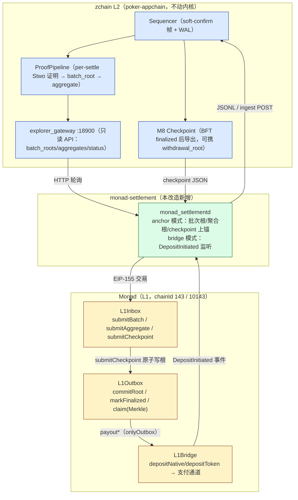

# Monad L2 结算层改造 —— 研究文档与架构设计（v1）

> 目标：把 zchain 扑克 appchain（poker-appchain，soft-confirm sequencer）改造为
> **Monad 的 L2**：自带 sequencer + 证明管道不动，**结算层放在 L1（Monad）实现**
> ——批次根 / checkpoint（state root）/ 提现根上锚到 Monad 结算合约，资产桥
> （MON / USDT / USDC）以 Monad 为唯一结算地；钱包（extension / wallet-app）
> 补齐 Monad 支持。
>
> 本文是单一事实源：§2 为 Monad 网络研究结论（含来源），§3 起为落地设计。
> 实施日期：2026-09-27。

---

## 1. 选型结论（对应接入清单 §1）

"接入 Monad 的 L2" 的两种工程含义中，本项目属于 **模式 B：新建 L2/Rollup，
把 Monad 当结算层**——Monad 是独立 L1，没有以太坊式原生 rollup 接口
（portal / blob / L1Block 语义），因此**自部署合约栈**（Inbox / Outbox /
Bridge / 权限基座），模式 A（LayerZero/Axelar/CCIP 跨链消息）不满足
"结算层在 L1" 的要求，仅可作为未来生态互操作的补充层（非本文范围）。

| 决策点 | 选择 | 理由 |
| --- | --- | --- |
| 模式 | B：Monad = settlement layer | 目标明确要求结算层在 L1(Monad)；zchain 已有 sequencer + ZK 证明管道，缺的正是外部结算锚 |
| 结算内容 | 32B 承诺（批次根/聚合根/state root/提现根），**不把 tx 数据放 Monad calldata** | 结算 ≠ DA；数据可用性由 zchain 自有层承载（WAL + 网关归档 + 证明注册表，见 da-selection.md），Monad 只存承诺 + 有序性 |
| 证明验证 | v1 不在 Monad 上验 ZK 证明 | Stwo 证明的链上验证需 Cairo-vm-on-EVM 或专用 verifier（cairo-bridge-poc 方向）；v1 以"证明 → batch_root → 上锚"的承诺链 + host-verify receipts 维持既有信任模型，合约栈为未来 verifier 预留接口形态（见 §6 已知缺口） |
| 最终性 | L2 BFT finalized 先于上锚；Monad 侧 `finalized` 标签 + 大额出块延迟 | 对齐接入清单 §6"提现安全：等 Monad Verified 再放行大额" |

---

## 2. Monad 网络研究结论（官方 docs.monad.xyz）

| 项 | 主网 | 测试网 |
| --- | --- | --- |
| Chain ID | **143**（0x8f） | **10143**（0x279f） |
| Gas 代币 | MON | MON |
| RPC（公共、限流） | `https://rpc.monad.xyz`（QuickNode，25 rps / batch 100）；`rpc1.monad.xyz`（Alchemy 15 rps）；`rpc2.monad.xyz`（Goldsky 300/10s，支持历史状态）；`rpc3.monad.xyz`（Ankr）；`rpc-mainnet.monadinfra.com`（20 rps） | `https://testnet-rpc.monad.xyz` |
| Explorer | monadvision.com（MonadVision）、monadscan.com | testnet.monadvision.com |
| WSS | `wss://rpc.monad.xyz` | — |

补充事实：

- **执行形态**：EVM 等价（当前 revision `MONAD_NINE` / v0.15.2）；以太坊
  预编译全量可用（本方案 Outbox 依赖 **sha256 预编译 0x02**）。
- **共识与最终性**：MonadBFT，单槽终结（亚秒级出块 + speculative finality；
  节点在终结后推进 `finalized` 区块标签）。本方案的不可逆判定统一走
  `eth_getBlockByNumber("finalized")`，不依赖自算窗口。
- **异步执行 / reserve balance**：与桥相关的含义是"执行语义与以太坊串行
  模型不完全一致"，大额提现以出块延迟兜底（§5.3）。
- **DA**：无以太坊式 blob；结算合约只接收 32B 根，规避 DA 语义差异。
- **既有合约生态**：Wrapped MON `0x3bd359C1119dA7Da1D913D1C4D2B7c461115433A`、
  Multicall3、Permit2、Safe、ERC-4337 EntryPoints v0.6–0.9 等已部署。

来源：
- <https://docs.monad.xyz/developer-essentials/network-information>（网络参数 / RPC / explorer / canonical contracts）
- <https://docs.monad.xyz/guides/add-monad-to-wallet/mainnet>（钱包接入参数）

---

## 3. 总体架构



资产路径：

- **入金（Monad → L2）**：用户 `L1Bridge.depositNative(to)`（或 ERC-20）锁仓 →
  `DepositInitiated(nonce, token, to, amount)` 事件 → daemon bridge 模式捕获
  （finalized 窗口，nonce 去重）→ JSONL / ingest POST → L2 sequencer 提交
  `DepositV2` op 铸 note（`deposit_id` 幂等，与 v1 deposit 幂等集交叉查重）。
- **出金（L2 → Monad）**：L2 内 REAL note burn → `WithdrawalLeaf`（含打款
  净额、外部收款地址、burned note 承诺）→ 按 checkpoint 分窗聚合成
  `withdrawalRoot` → checkpoint **BFT finalized** 后由 daemon 把
  `submitCheckpoint(head, state_root, withdrawal_root, leaf_count)` 原子上锚
  （Inbox 内部调 `Outbox.commitRoot(finalized=true)`）→ 用户（或代办方）持
  Merkle 证明 `L1Outbox.claim(...)` 领取（原生 MON 走 Bridge 库、ERC-20 走
  `tokenForTag` 映射、PLAY 拒绝——L2 内部筹码不提供 L1 兑付）。

---

## 4. 交付物清单（本次全部落地）

| 组件 | 位置 | 说明 |
| --- | --- | --- |
| 结算合约栈 | [contracts/monad/](../contracts/monad/) | `L1Inbox`（连续批次/聚合/checkpoint 锚定）、`L1Outbox`（提现根 + Merkle claim）、`L1Bridge`（资金库）、`AuthorityOwnable`（两步转移 + 暂停）；foundry 脚手架 + 部署脚本 + 单测（治理/重放/授权面） |
| Rust 结算适配层 | [monad-settlement/](../monad-settlement/) | EIP-155 签名器（low-s 规范化）、最小 RLP/ABI、Monad JSON-RPC 客户端（`finalized` 标签）、`AnchorSubmitter`（幂等 + nonce + 回执 + 最终性状态机）、`DepositWatcher`、`proof`（Outbox 树逐字节镜像）；`monad_settlementd` 守护进程（anchor/bridge/all） |
| extension 钱包 | `extension/common/evm/networks.js`、`extension/common/networks.js` | Monad 主网（143）/测试网（10143）预设（官方 RPC/explorer）+ `settlement` 标记；zchain 网络携带 `settlementL1` / `settlementChainIdHex` 结算层元数据 |
| wallet-app | `wallet-app/crates/zwallet/src/dto.rs`、`lib.rs` | `SETTLEMENT_L1` / `SETTLEMENT_L1_CHAIN_ID` 常量 + `StatusDto.settlement_l1*` 透出（状态页可展示结算层） |
| 设计文档 | 本文 | 研究结论 + 架构 + runbook + 审计清单 |

---

## 5. 关键设计决策

### 5.1 上锚纪律：只锚已验证 / 已终结产物

| 数据 | 来源（产物形态） | 锚定入口 |
| --- | --- | --- |
| 批次根 | ProofPipeline `try_build_batch`（per-batch prove + verify 通过）→ 网关 `batch_roots`（proven log） | `submitBatch(index, root, through_op)` |
| 聚合根 | 二级聚合 `aggregate_due` → 网关 `aggregates` | `submitAggregate(index, root, through_op, batch_count)` |
| checkpoint | M8 checkpoint JSON（BFT finalized 流程产出，`zchain.appchain.checkpoint.v1`）| `submitCheckpoint(head_index, state_root, withdrawal_root?, leaf_count)` |

合约侧 fail-closed：批次/聚合 index **严格连续**（乱序即 revert）；checkpoint
按 L2 高度键控、同高度不可覆写（daemon 幂等由状态文件 + key 去重承担）。

### 5.2 提现树：三方逐字节对齐 + 交叉验证测试

`WithdrawalLeaf` 树规则（域 `zchain.vault.withdrawal_root.v1`，RFC 6962 风格
域分隔 sha256）在**三处**实现，必须同步演进：

1. 权威构造：`poker-appchain/src/withdrawal_root.rs`（L2 builder）；
2. L1 校验：`contracts/monad/src/L1Outbox.sol`（borsh 叶子 = 113B 紧凑小端，
   用 sha256 预编译重算叶/节点/摘要；u64 小端手工展开）；
3. 镜像守卫：`monad-settlement/src/proof.rs`（Rust 侧等价 verifier）。

守卫测试 `monad-settlement/tests/withdrawal_crosscheck.rs`：真实 builder 产根
/证明 → 镜像 verifier 必须接受；换叶/换 index/换根/跨窗混用必须拒绝。该测试
是"合约不重编译也能验证树规则对齐"的持续保障（本机无 foundry 时的替代证据面）。

### 5.3 最终性与大额提现安全

- **L2 → L1**：checkpoint 必须 BFT finalized 才产出 → 上锚（daemon 只接受
  M8 checkpoint 文件形态，不接受软确认 state root）。
- **L1 内不可逆判定**：daemon 以 `eth_getBlockByNumber("finalized")` 为准
  （MonadBFT 单槽终结；`AnchorSubmitter` 的 Finalized 状态以此推进）。
- **大额延迟**：`L1Outbox.claim` 对超过 `largePayoutThreshold[tag]` 的金额
  要求 `block.number ≥ committedAt + claimDelayBlocks`（默认 30 块），覆盖
  Monad 异步执行/极端 reorg 窗口——对应接入清单"等 Verified 阶段再放行大额"。
- **防重放四层**：EIP-155 签名域绑定 chainId（143/10143 之外 daemon 拒连）；
  checkpoint 同高度不可覆写；提现 `request_id` 全局记账；入金 nonce 单调 +
  L2 `deposit_id` 幂等。

### 5.4 权限与资金安全

- 单一 `authority`（= sequencer/运营方，生产建议多签）+ 两步转移 + 全局
  pause；合约无 owner 提款——**资金只能经 Outbox 证明路径流出**（Bridge
  支付仅 `onlyOutbox`；claim 先置 claimed 再支付，effects-before-interactions）。
- 互联边一次性设置：`outbox.setInbox(inbox)`、`outbox.setBridge(bridge)`、
  `inbox.setOutbox(outbox)`（部署脚本原子完成）。

---

## 6. Runbook

### 6.1 部署（主网 143 / 测试网 10143）

```bash
cd contracts/monad
forge install foundry-rs/forge-std && forge test   # 先跑合约单测
export AUTHORITY_ADDRESS=0x…                       # 运营多签
export MONAD_RPC_URL=https://rpc.monad.xyz         # 或 testnet-rpc
export PRIVATE_KEY=0x…                             # 部署私钥
forge script script/Deploy.s.sol --rpc-url monad --broadcast --verify
# 可选：export USDT_ADDRESS=… / USDC_ADDRESS=…（tag 3/4 映射）
```

记录输出的 `L1Bridge / L1Outbox / L1Inbox` 三个地址。

### 6.2 结算守护进程

```bash
cargo build -p monad-settlement --release
./target/release/monad_settlementd --mode all \
  --l1-rpc https://rpc.monad.xyz --expected-chain-id 143 \
  --inbox 0x… --bridge 0x… \
  --key-env MONAD_SETTLEMENT_KEY \
  --gateway http://127.0.0.1:18900 \
  --checkpoint-file ./data/checkpoints/latest.json \
  --state-file ./data/settlement-state.json \
  --deposits-file ./data/deposits.jsonl \
  --poll-interval-ms 4000
```

- `--expected-chain-id` 不匹配直接退出（防错链）。
- 状态文件原子写（tmp+rename），重启恢复 anchor 状态与入金水位，不重放。
- bridge 模式产出：JSONL（每行一个 `DepositInitiated`）+ 可选
  `--ingest-url`（POST 到 L2 运营 ingest；sequencer 转 `DepositV2` op，
  deposit_id = f(L1 nonce, token, to, amount)，幂等）。
- 公共 RPC 限流（25/15/20 rps）：`--poll-interval-ms` 不得低于 1s；窗口
  超限（eth_getLogs 5k 条上限）时收窄 `--bridge-start-block` 分段补扫。

### 6.3 验收清单

> **2026-09-27 测试网验收已完成**，记录见
> [test-records/2026-09-27-monad-testnet-acceptance.md](test-records/2026-09-27-monad-testnet-acceptance.md)：
> probe 模式 7/7 PASS（chainId 10143 / 出块推进 / finalized 标签滞后 ≤3 块 /
> gas 102 gwei / 账户面 / getLogs / EIP-155 交易被真实网络接受至资金闸门），
> 合约栈 solc 0.8.28 真编译 + ABI↔Rust selector 对拍通过，**forge test
> 13/13 PASS**（并抓出 `bridge.setOutbox` 接线缺失缺陷，已修复）。验收还
> 抓出并修复了签名器广播体布局 bug（签名摘要段误并入广播体 → 12 项非法
> RLP），已加 `signed_tx_layout_is_nine_items` 防回归。快速复核：
>
> ```bash
> cd contracts/monad && PATH="$HOME/.foundry/bin:$PATH" forge test && cd ../..
> contracts/monad/build_solc.sh && cargo test -p monad-settlement
> cargo run -p monad-settlement --bin monad_settlementd -- --mode probe \
>   --l1-rpc https://testnet-rpc.monad.xyz --expected-chain-id 10143
> ```
>
> 链上 E2E（部署/上锚/入金/提现/大额延迟）已压缩为单命令
> `monad_e2e`（带水测试钥即可执行，无钥时 P0 闸门 fail-fast）：
>
> ```bash
> export MONAD_TESTNET_KEY=0x…   # 带水测试钥（官方水龙头人工领取）
> cargo run -p monad-settlement --bin monad_e2e -- \
>   --l1-rpc https://testnet-rpc.monad.xyz --chain-id 10143 \
>   --key-env MONAD_TESTNET_KEY --bytecode-dir contracts/monad/out/solc
> ```
>
> 以下为完整清单；带 ⛏ 项由上述单命令覆盖，唯"为 key 领水"需人工完成。

- [x] 合约单测（forge test **13/13 PASS**，foundry 1.8.3）+ Rust 交叉验证（cargo test -p monad-settlement 26 项）双绿
- [ ] ⛏ 部署后 `cast call $INBOX "batchCount()"` 可读且 = 0
- [ ] ⛏ daemon 首轮把网关存量批次根全部上锚（日志 batch #N submitted）
- [ ] ⛏ 一笔测试入金：Monad → DepositInitiated → JSONL → L2 铸 note（幂等重放不双铸）
- [ ] ⛏ 一笔测试提现：L2 burn → checkpoint 携根 → 上锚 → claim 到账（原生 MON）
- [ ] ⛏ 大额提现被 `ClaimTooEarly` 拦截至延迟期满
- [x] `--expected-chain-id 1` 启动必须退出（错链闸门；probe #1 在真实网络复核）

---

## 7. 测试证据（2026-09-27）

| 套件 | 结果 |
| --- | --- |
| `cargo test -p monad-settlement` | **24 通过**（EIP-155 官方向量 / RLP / ABI / 树镜像 / mock L1 全流程 / builder↔镜像交叉验证） |
| `cargo test -p poker-appchain -p poker-settlement-core` | 180 + 10 + 3 + 3 + 7 全绿（回归无影响） |
| `zwallet`（wallet-app） | 19 通过（含 status 网络视图） |
| extension `npm test` | 335/336（唯一失败 `prd_static_guards` 为**预置**：manifest host 权限含 `zchain.secretpokers.com`，与本改造无关，HEAD 上同样失败） |
| `cargo check --workspace` | 通过（vendored `stwo-cairo-prover` 的 test-target 缺依赖为预置问题，lib target 不受影响） |

新增扩展测试：`extension/tests/evm/monad.test.js`（6 项：官方参数 / settlement
标记 / RPC 覆盖 / zchain↔EVM 注册表一致性）。

---

## 8. 钱包侧行为变化

- **extension（浏览器）**：网络切换页出现 Monad 主网 / 测试网（EIP-1193
  适配面自动生效：chainId 0x8f / 0x279f，官方 RPC）；zchain 网络的结算层
  元数据随 `resolveNetwork` 透出，UI 可展示"结算于 Monad 测试网"。
- **wallet-app（桌面/移动）**：状态 DTO 新增 `settlement_l1` /
  `settlement_l1_chain_id`（devnet 阶段 = `monad-devnet`/31337 本地模拟，
  接入后切 10143/143）。
- **poker-wallet（Rust 核心）**：无需改动——`operation_signer` 的确认摘要
  早已绑定 chain_id 字符串域（WALLET-ACC-2），Monad 结算不改变 L2 操作签名
  语义；EVM 侧签名（EIP-155）在 `monad-settlement::signer`，域同样绑定
  chainId。

---

## 9. 审计关注点（对应接入清单 §7）

1. **reserve balance / 异步执行**：Monad 执行语义与以太坊串行模型差异 →
   大额延迟参数（`claimDelayBlocks`）上线路径必须复核；`finalized` 标签
   在 Monad 的推进语义以节点文档为准。
2. **reorg**：入金监听窗口只到 finalized；上锚状态机 Included→Finalized
   以 finalized 高度推进，Submitted 期间的"回执存在但未终结"窗口依赖
   L1 finalized（BFT 链无概率性回滚，此窗口为防御性设计）。
3. **message replay**：§5.3 四层防重放；L1Outbox `claim` 的 proof 数组
   深度 ≥64 拒绝 + index 越界拒绝（与 Rust fail-closed 边界一致）。
4. **字节对齐回归**：任何 `WithdrawalLeaf` 编码/域标签改动必须三处同步
   （§5.2）并跑交叉验证测试；合约 golden 向量（leaf_hash/digest）建议在
   foundry 侧固化（后续项）。
5. **密钥管理**：daemon `--key-env`/`--key-file` 仅为 v1 形态；生产建议
   authority 走多签（ Safe 在 Monad 已有确定性部署），daemon 改为提交
   交易到多签队列。

---

## 10. 已知缺口与后续路线

| 项 | 状态 | 说明 |
| --- | --- | --- |
| Monad 上链上验 ZK 证明 | 未实施（刻意） | cairo-bridge-poc（Cairo verifier on EVM）成熟后接入；v1 信任 = 承诺链 + L2 既有 host-verify receipts |
| checkpoint BFT finalized 信号自动化 | 部分 | daemon 消费 M8 checkpoint 文件；"finalized → 导出 → daemon 拾取"的自动化管道由主控侧编排（文件即接口） |
| L2 ingest 端点 | 未实施 | daemon 已支持 `--ingest-url` POST；sequencer 侧 HTTP ingest API 待主控排期（当前 JSONL + 人工/运维提交 DepositV2） |
| daemon 代领提现（claim relayer） | 未实施 | claim 所需 leaf/proof 由 L2 侧导出（builder API 已具备），代领是纯运维增强，permissionless claim 不受影响 |
| 合约正式审计 | 未启动 | 上主网前置门槛（§9 清单） |
| 模式 A 互操作（LayerZero/CCIP） | 不在范围 | 未来生态互通另行立项 |

---

## 11. 相关文档

- [00-architecture-overview.md](00-architecture-overview.md) — zchain 总体架构（本文的 L1 背景板）
- [da-selection.md](da-selection.md) — L2 数据可用性选型（结算 ≠ DA 的分工依据）
- [37-4-bridge-extension.md](37-4-bridge-extension.md) — zchain 既有 bridge 面（poker_l1 内部桥，与 Monad 结算桥分层不冲突）
- [contracts/monad/README.md](../contracts/monad/README.md) — 合约部署与字节对齐说明
- `monad-settlement/` crate 文档注释 — 适配层 API 细节
