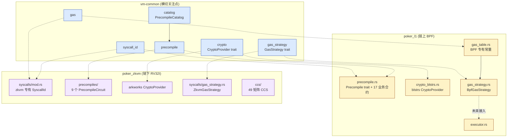

# vm-common 架构文档

> **目的**：本文档说明 `vm-common` crate 的设计目标、模块结构、跨 crate 关系与未来演进路线。它是 VM 统一工作（Phase 1–5）的最终架构沉淀。
>
> **关联文档**：
> - 仓库级架构总览：`docs/00-architecture-overview.md`
> - 合约开发者指南：`vm-common/CONTRACT_DEV_GUIDE.md`
> - 续作计划：`.trae/documents/vm_unification_phase3_5_continuation.md`

---

## 1. 设计目标

`vm-common` 是 `poker_l1`（链上 BPF VM）与 `poker_zkvm`（链下 RV32I ZK VM）之间的**共享横切关注点**集合。它服务于两个核心动机：

1. **减少代码重复与维护成本**：将两个 VM 共享的概念（gas 常量、syscall ID、预编译元数据、crypto 原语接口、gas 策略形式化、预编译可用性目录）集中到单一 crate。
2. **合约开发者单一入口**：通过 [`PrecompileCatalog`](src/catalog.rs) 提供"哪些预编译在 L1 / zkvm 可用、gas 策略如何"的统一查询接口，开发者无需阅读两个 VM 源码。

### 1.1 非目标（明确不做）

- **不统一 ISA**：BPF 与 RV32I 是两套不同的指令集，强行统一会破坏 zkvm 的 CCS 约束系统（49 矩阵 × 93 子集强耦合 RV32I）。
- **不统一 `Precompile::call()` 签名**：`call()` 依赖各 VM 专有类型（`ObjectID`/`Address`/`ObjectDb`/`PokerL1Error`），迁入 vm-common 会破坏"vm-common 不含 ISA 语义"原则。完整 `call()` 统一推迟到有具体业务需求时再做。
- **不改造现有 executor 调用路径**：Phase 4 的 `GasStrategy` 是形式化层，不接入 `PokerL1Context::new` / `execute_elf_with_limits_and_config`。让 executor 改用 `GasStrategy` 是未来增量工作。

### 1.2 安全保证

```rust
#![deny(unsafe_code)]
#![forbid(unsafe_code)]
```

`vm-common` 严格不引入任何 unsafe 代码，与 `poker_zkvm` 的 `#![deny(unsafe_code)]` 保持一致。`poker_l1` 的 `#![allow(unsafe_code)]` 不受影响（unsafe 仅在 `poker_l1` 内部，由 `solana_rbpf` 引入）。

---

## 2. 模块结构

```text
vm-common/src/
├── lib.rs              # crate 入口，声明六大模块
├── gas.rs              # Phase 1 — gas 常量单一事实源
├── syscall_id.rs       # Phase 1 — 统一 SyscallId 枚举（35 变体）
├── precompile.rs       # Phase 2 — PrecompileMetadata trait + PrecompileStatus + ID 生成
├── crypto.rs           # Phase 3 — CryptoProvider trait（18 方法，字节级接口）
├── gas_strategy.rs     # Phase 4 — GasStrategy trait + InsnCategory（9 变体）
└── catalog.rs          # Phase 5 — PrecompileCatalog 跨 VM 可用性目录（28 条目）
```

| 模块 | 行数 | 关键导出 | 实现方 |
| --- | --- | --- | --- |
| `gas` | ~424 | `TX_GAS_LIMIT`, `BLOCK_GAS_LIMIT`, `GAS_SECP256K1_VERIFY`, `object_read_gas()` 等 | vm-common（纯函数） |
| `syscall_id` | ~336 | `SyscallId` 枚举（35 变体）, `from_u32()`, `is_zkvm()`/`is_poker_l1()`/`is_shared()`/`is_bls12_381()` | vm-common |
| `precompile` | ~252 | `PrecompileMetadata` trait, `PrecompileStatus`, `PrecompileVersion`, `precompile_id_from_name()`, `PRECOMPILE_PREFIX` | vm-common |
| `crypto` | — | `CryptoProvider` trait（18 方法） | vm-common（trait） + poker_l1（blstrs impl） + poker_zkvm（arkworks impl） |
| `gas_strategy` | ~141 | `GasStrategy` trait（6 方法）, `InsnCategory`（9 变体） | vm-common（trait） + poker_l1（`BpfGasStrategy`） + poker_zkvm（`ZkvmGasStrategy`） |
| `catalog` | ~346 | `PrecompileCatalog`, `CatalogEntry`, `PrecompileCategory`（6 变体） | vm-common（硬编码 28 条目） |

---

## 3. 跨 crate 关系



### 3.1 依赖方向（严格单向）

```text
poker_l1 ──► vm-common ◄── poker_zkvm
```

- `vm-common` 不依赖 `poker_l1` 或 `poker_zkvm`，**不依赖** `solana_rbpf` 或 `arkworks`。
- `poker_l1` 与 `poker_zkvm` 都依赖 `vm-common`，各自实现 trait。

### 3.2 ISA 专有常量保留在各 crate 本地

| 常量 | 位置 | 说明 |
| --- | --- | --- |
| `GAS_ARITHMETIC=1`, `GAS_MEMORY_BASE=3`, `GAS_BRANCH=2` | `poker_l1/src/vm/gas_table.rs` | BPF 专有，由 `BpfGasStrategy` 复用 |
| `TX_GAS_LIMIT=10M`, `BLOCK_GAS_LIMIT=50M`, `GAS_SECP256K1_VERIFY=500` | `vm-common/src/gas.rs` | 跨 VM 共享 |
| RV32I 指令 gas（全 0） | `poker_zkvm/src/syscalls/gas_strategy.rs` | zkvm 专有，由 `ZkvmGasStrategy` 返回 |

---

## 4. 关键设计决策

### 4.1 非侵入式抽象层（Option B）

用户从三种方案中选择：

| 方案 | 描述 | 取舍 |
| --- | --- | --- |
| Option A：完整 VM 统一 | 两个 VM 合并为单一引擎 | 拒绝：CCS 强耦合 RV32I，重写代价过高 |
| **Option B：非侵入式抽象层** ✅ | 保留两引擎，通过 vm-common 共享横切关注点 | **采纳**：低风险、可增量、保护既有投资 |
| Option C：完全独立 | 不做任何统一 | 拒绝：代码重复持续恶化 |

Phase 1–5 全部在 Option B 框架下完成，**不修改任何现有 executor 签名、syscall 注册路径、业务合约实现**。

### 4.2 GasStrategy 是形式化层，不接入 executor

`GasStrategy` trait 定义了 6 个方法（`instruction_gas` / `syscall_gas` / `instruction_meter_enabled` / `default_tx_gas_limit` / `default_block_gas_limit` / `name`），并由 `BpfGasStrategy` 与 `ZkvmGasStrategy` 双实现。**但 Phase 4 不修改 `PokerL1Context::new` 或 `execute_elf_with_limits_and_config` 的签名**。

理由：
- `PokerL1Context::new` 当前直接读取 `gas::TX_GAS_LIMIT`，接入 `GasStrategy` 需要修改所有调用点（至少 30 处）。
- GameTurn gas-free 硬约束要求"接入时必须保证 gas-free lane 不被破坏"，需要专门的回归测试。
- 接入是增量工作，应在 Phase 6+ 单独立项。

### 4.3 PrecompileCatalog 是只读目录，不参与运行时分派

`PrecompileCatalog::default_catalog()` 在编译期硬编码 28 个条目（4 哈希 + 3 签名 + 3 配对 + 17 业务 + 1 ZK），反映 `poker_l1/src/vm/contracts/` 与 `poker_zkvm/src/precompiles/` 的实际实现。它**不**参与运行时合约分派（那是 `PrecompileRegistry` 的职责），仅作为开发者查询接口与未来工具链（如 SDK、文档生成器）的数据源。

### 4.4 ID 生成使用 SipHash-1-0-3 + 0xFF 前缀

`precompile_id_from_name(name)` 使用 `DefaultHasher`（SipHash-1-0-3）对名称哈希，第 0 字节固定为 `0xFF`（预编译保留前缀），第 1-8 字节为哈希值的 LE 编码。

理由：
- 同进程内稳定（同名称 → 同 ID）。
- 跨进程稳定性由 `poker_l1::ObjectID` 序列化保证（adapter 仅用于运行时元数据查询）。
- `0xFF` 前缀避免与用户合约 ObjectID 冲突。

---

## 5. Phase 1–5 完成清单

| Phase | 内容 | 测试数 | 状态 |
| --- | --- | --- | --- |
| Phase 1 | `gas` + `syscall_id` 迁入 vm-common | 35+ | ✅ |
| Phase 2 | `precompile`（PrecompileMetadata trait + ID 生成）迁入 | 7 | ✅ |
| Phase 3 | `crypto`（CryptoProvider trait）+ 跨 VM 一致性测试 | 10 | ✅ |
| Phase 3.6-3.7 | 修复截断的 crypto_consistency.rs + 回归 | 10+11 | ✅ |
| Phase 4 | `gas_strategy`（GasStrategy trait + Bpf + Zkvm + 一致性测试） | 3+6+6+8=23 | ✅ |
| Phase 5.1 | `syscall_id` doc-comments（44 条，覆盖全部 35 变体） | — | ✅ |
| Phase 5.3-5.4 | `catalog`（PrecompileCatalog + 28 条目） | 14 | ✅ |
| Phase 5.2 | 本文档（ARCHITECTURE.md） | — | ✅ |
| Phase 5.5 | 合约开发者指南（CONTRACT_DEV_GUIDE.md） | — | ✅ |

---

## 6. 未来演进路线（Phase 6+，未排期）

### 6.1 GasStrategy 接入 executor

让 `PokerL1Context::new` 接受 `&dyn GasStrategy` 参数，替换直接读取 `gas::TX_GAS_LIMIT`。需要：
- 修改所有 `PokerL1Context::new` 调用点（~30 处）。
- 为 GameTurn gas-free lane 增加专门回归测试。
- 确保现有 gas 计费路径（`poker_l1/src/vm/syscalls.rs`）与新策略一致。

### 6.2 跨 VM `Precompile::call()` 统一

当前 `PrecompileMetadata` 仅含元数据方法，不含 `call()`。若未来需要"同一预编译在 L1 与 zkvm 间无缝迁移"，需要：
- 在 vm-common 定义带关联类型的 `PrecompileCall<Ctx, Err>` trait。
- 17 个业务合约改为 impl 新 trait（破坏"零修改"承诺，需评估收益）。
- 或保持现状，通过 adapter 模式在 zkvm 侧包装 L1 合约。

### 6.3 PrecompileCatalog 自动化校验

当前 28 个条目手动维护，可能与实际实现漂移。未来可：
- 在 CI 中增加测试，遍历 `poker_l1/src/vm/contracts/` 与 `poker_zkvm/src/precompiles/` 目录，校验 catalog 条目与实际文件一致。
- 或用 procedural macro 从合约注册注解自动生成 catalog。

### 6.4 CryptoProvider 完整实现

当前 `CryptoProvider` trait 已定义 18 方法，但 poker_l1（blstrs）与 poker_zkvm（arkworks）的实现可能未覆盖全部方法。未来需：
- 补全两侧实现。
- 增加跨实现一致性测试（已有 10 个，可扩展）。

---

## 7. 测试与验证

### 7.1 单元测试

```bash
cargo test -p vm-common
# 期望：~60+ tests pass
```

各模块独立测试数：
- `gas`: 已有
- `syscall_id`: 35+
- `precompile`: 7
- `crypto`: —
- `gas_strategy`: 3
- `catalog`: 14

### 7.2 跨 VM 一致性测试

```bash
cargo test -p poker_l1 --test crypto_consistency       # 10 tests
cargo test -p poker_l1 --test gas_strategy_consistency # 8 tests
```

### 7.3 文档构建

```bash
cargo doc -p vm-common --no-deps --open
# 期望：无警告，所有 pub 项有 doc-comment
```

### 7.4 工作区回归

```bash
cargo test --workspace
# 期望：全部通过（不破坏既有 1350+ 测试）
```

---

## 8. 引用

- 计划文档：`.trae/documents/vm_unification_phase3_5_continuation.md`
- 仓库架构总览：`docs/00-architecture-overview.md`
- 合约开发指南：`vm-common/CONTRACT_DEV_GUIDE.md`
- vm-common 源码：`vm-common/src/`
